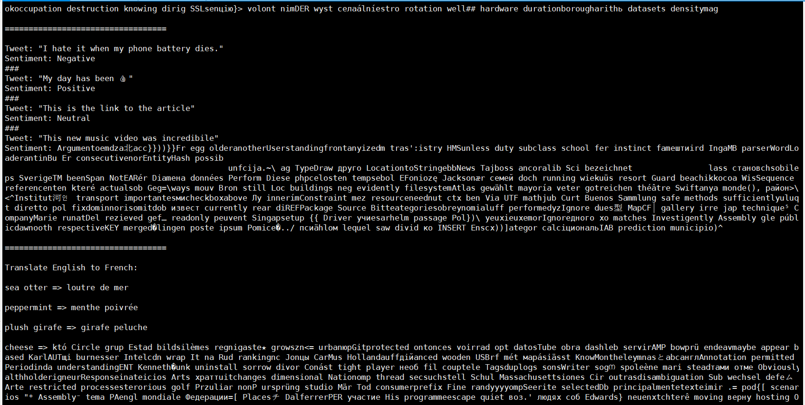

## 安装

- pip install -U deep_training >= 0.0.18 fairscale
- 当前文档版本pypi 0.0.18

## 更新详情

- [deep_training](https://github.com/ssbuild/deep_training)

## 深度学习常规任务例子

- [pytorch-task-example](https://github.com/ssbuild/pytorch-task-example)
- [tf-task-example](https://github.com/ssbuild/tf-task-example)


## LLaMA finetuning 权重下载
    预训练模型下载 https://huggingface.co/nyanko7/LLaMA-7B


## 数据示例
    给出一种qa 数据示例 , 如果想跟母模型保持一致，可以参考LLaMA https://arxiv.org/abs/2302.13971v1 数据组织结构.
    单条数据示例1
    {
        "id": 0, "paragraph": [
            #一轮会话
            {
                "q": "从南京到上海的路线",
                "a": [
                    "你好，南京到上海的路线如下：",
                    "1. 南京到上海，可以乘坐南京地铁1号线，在南京站乘坐轨道交通1号线。",
                    "2. 南京到浦东机场，可以搭乘上海地铁1号，在陆家嘴站乘坐地铁1线，在浦东国际机场站乘坐机场快线，前往上海浦东国际机场。",
                    "3. 上海到南京，可以换乘上海地铁2号线，从南京站换乘地铁2线，再从南京南站换乘地铁1路，然后到达上海站"
                ]
            }
            #二轮....
        ]
    }
    单条数据示例2
    {"id": 0, "paragraph": [

        {
            "q": "写一个诗歌，关于冬天",
            "a": [
                "冬夜寂静冷，",
                 "云在天边飘，", "冰封白雪上， ", "寒冷像一场雪。",
                 " ",
                 "雪花融化成冰，",
                 "像那雪花飘洒，",
                 "在寒冷的冬天，",
                 "感受春天的喜悦。",
                 " 冬日里，",
                 "风雪渐消，",
                 "一片寂静，",
                 "把快乐和温暖带回家。"
            ]
        }
        ]
    }


## 生成训练record

    python data_utils.py
    
    注:
    num_process_worker 为多进程制作数据 ， 如果数据量较大 ， 适当调大至cpu数量
    dataHelper.make_dataset_with_args(data_args.train_file,mixed_data=False, shuffle=True,mode='train',num_process_worker=0)


## 推理
    12g 显卡即可测试
    torchrun --nproc_per_node 1 infer.py



## 训练
    完整参数为 config.json
    若显卡容留不足 ， 可以修改 config_small.json n_layer 层数

    torchrun --nproc_per_node 1 train.py


##  注: Different models require different MP values:

|  Model | MP |
|--------|----|
| 7B     | 1  |
| 13B    | 2  |
| 33B    | 4  |
| 65B    | 8  |


## Reference

LLaMA: Open and Efficient Foundation Language Models -- https://arxiv.org/abs/2302.13971

```
@article{touvron2023llama,
  title={LLaMA: Open and Efficient Foundation Language Models},
  author={Touvron, Hugo and Lavril, Thibaut and Izacard, Gautier and Martinet, Xavier and Lachaux, Marie-Anne and Lacroix, Timoth{\'e}e and Rozi{\`e}re, Baptiste and Goyal, Naman and Hambro, Eric and Azhar, Faisal and Rodriguez, Aurelien and Joulin, Armand and Grave, Edouard and Lample, Guillaume},
  journal={arXiv preprint arXiv:2302.13971},
  year={2023}
}
```